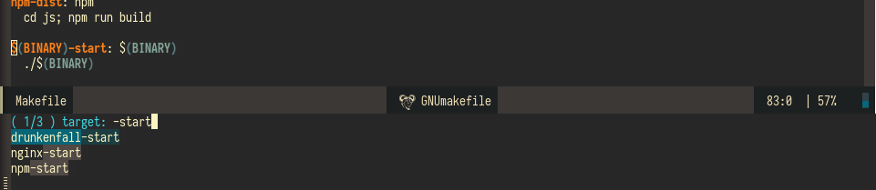

# makefile-executor.el

[](https://melpa.org/#/makefile-executor)



Screenshot showing the Makefile target selection
for [drunkenfall](https://github.com/drunkenfall/drunkenfall). Notice how the `$(BINARY)` part is calculated to
it's value in the minibuffer selection.

### Installation

Install the `makefile-executor` package from MELPA!

Using `use-package`:
```
(use-package makefile-executor
  :config
  (add-hook 'makefile-mode-hook 'makefile-executor-mode))
```

### Features

- Interactively selecting a make target and running it.  Bound
  to `C-c C-e` in `makefile-mode` when `makefile-executor-mode` is
  enabled.
- Re-running the last execution.  We usually run things in Makefiles
  _many_ times after all!  Bound to `C-c C-c` in `makefile-mode` when
  `makefile-executor-mode` is enabled.
- Running a makefile target in a dedicated buffer.  Useful when
  starting services and other long-running things!  Bound to `C-c
  C-d` in `makefile-mode` when `makefile-executor-mode` is enabled.
- Calculation of variables et.c.; `$(BINARY)` will show up as what it
  evaluates to.
- If [projectile](https://github.com/bbatsov/projectile) is installed,
  execution from any buffer in a project.  If more than one Makefile
  is found, an interactive prompt for one is shown.  This is added to
  the `projectile-commander` on the `m` key.

### Public API

* `makefile-executor-execute-target`: Bring up a selection of all the possible
  targets in the current Makefile, and execute the chosen one. .
*  `makefile-executor-execute-project-target`: Bring up a selection of all the
   Makefiles in the current project. The selected one is executed as
   per `makefile-executor-execute-target` above.
*  `makefile-executor-execute-last`: Execute the last makefile target
   for the project. If none has been run, this executes
   `makefile-executor-execute-project-target`.

### License

This project is free software; you can redistribute it and/or modify
it under the terms of the GNU General Public License as published by
the Free Software Foundation; either version 3, or (at your option)
any later version.
